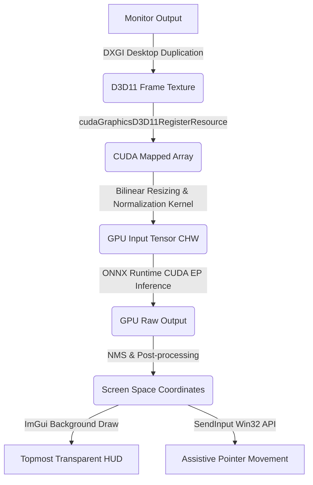

# Real-Time Screen Analysis & Assistive Pointing Hub

This is a modern, high-performance C++ (C++17) application designed for real-time screen analysis, object detection, and assistive pointing on Windows.

It leverages the **DXGI Desktop Duplication API** for ultra-fast screen capture, **CUDA-D3D11 Interop** to map captured frames directly into CUDA memory for GPU-based resizing/normalization, and the **ONNX Runtime (CUDA Execution Provider)** to run object detection (YOLOv5/YOLOv8) with zero CPU-GPU transfer overhead. The interactive overlay is built using **DirectX 11** and **Dear ImGui**.

---

## Technical Architecture



---

## Prerequisites & Dependencies

To build and run this application, ensure your environment meets the following requirements:

1. **Windows OS** (DXGI and Win32 targeting).
2. **NVIDIA GPU** with CUDA support.
3. **NVIDIA CUDA Toolkit** (11.0 or newer recommended, system variables configured).
4. **CMake** (v3.18 or newer).
5. **Visual Studio 2022** (with "Desktop development with C++" and MSVC compiler suite).

### Library Dependencies

* **OpenCV**: Used for NMS bounding boxes math and image data structures. Can be easily installed via [vcpkg](https://github.com/microsoft/vcpkg):
  ```powershell
  vcpkg install opencv4:x64-windows
  ```
* **ONNX Runtime (with GPU support)**: Make sure to download the GPU/CUDA edition of the DLLs and headers (e.g., `onnxruntime-win-x64-gpu-1.x.x`). You will point CMake to this directory using `CMAKE_PREFIX_PATH` or specify it manually.
* **Dear ImGui**: Handled automatically! The build configuration utilizes CMake's `FetchContent` to download the docking branch of Dear ImGui during compilation.

---

## Build Instructions

Follow these steps to generate the build files and compile the executable:

1. Create a `build` directory inside the project root:
   ```powershell
   mkdir build
   cd build
   ```

2. Run CMake configure. Pass the paths to your OpenCV and ONNX Runtime directories:
   ```powershell
   cmake -DCMAKE_PREFIX_PATH="C:/Path/To/opencv;C:/Path/To/onnxruntime-win-x64-gpu" ..
   ```
   *Note: If ONNX Runtime is not automatically picked up, you can manually set the `-DONNXRUNTIME_INCLUDE_DIRS="C:/Path/To/onnxruntime/include"` and `-DONNXRUNTIME_LIBRARIES="C:/Path/To/onnxruntime/lib/onnxruntime.lib"` flags.*

3. Compile the project:
   ```powershell
   cmake --build . --config Release
   ```

---

## Running the Application

### 1. Model Configuration
Create a folder named `models` relative to the output executable (usually in `build/Release/models`).
Place your YOLOv5 or YOLOv8 `.onnx` models inside this directory:
```
├── build/
│   └── Release/
│       ├── ScreenAnalysisTool.exe
│       ├── onnxruntime.dll         # Copy this from your ONNX Runtime folder!
│       └── models/
│           ├── yolov8n.onnx
│           └── custom-yolov5.onnx
```

### 2. Launching
* Run `ScreenAnalysisTool.exe`.
* A console window will pop up showing diagnostic information (such as CUDA initialization status), followed by the borderless transparent overlay covering your primary screen.
* The **Assistive Pointing Hub** ImGui configuration panel will float on top.

### 3. Usage Controls
* **Model Selector**: Dynamically select and load any `.onnx` model found in `./models`.
* **FOV Size**: Configure the targeting field-of-view box to either `320x320` or `640x640` centered around the mouse.
* **FPS Slider**: Limit the capture/inference thread speed from 1 up to 400 frames per second to save resources.
* **Aim Assist**: Toggle auto-aim. When enabled, holding down the **Right Mouse Button** will instantly align the mouse to the center of the closest detected object within your selected FOV.
* **Diagnostics**: View actual frame capture time, CUDA preprocessing time, and model inference latency in real-time.
